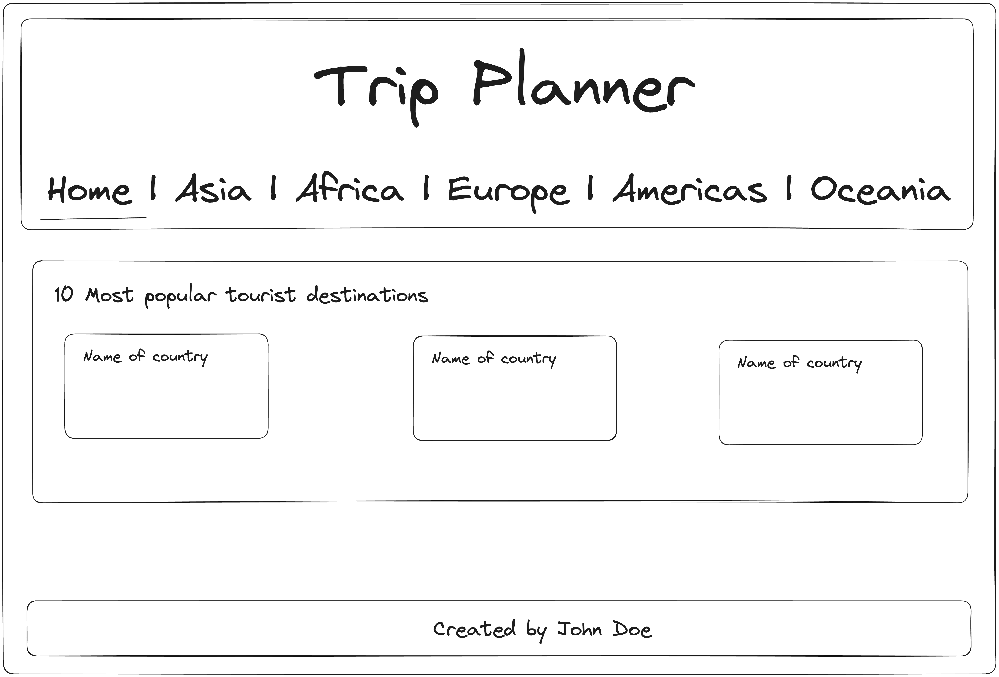
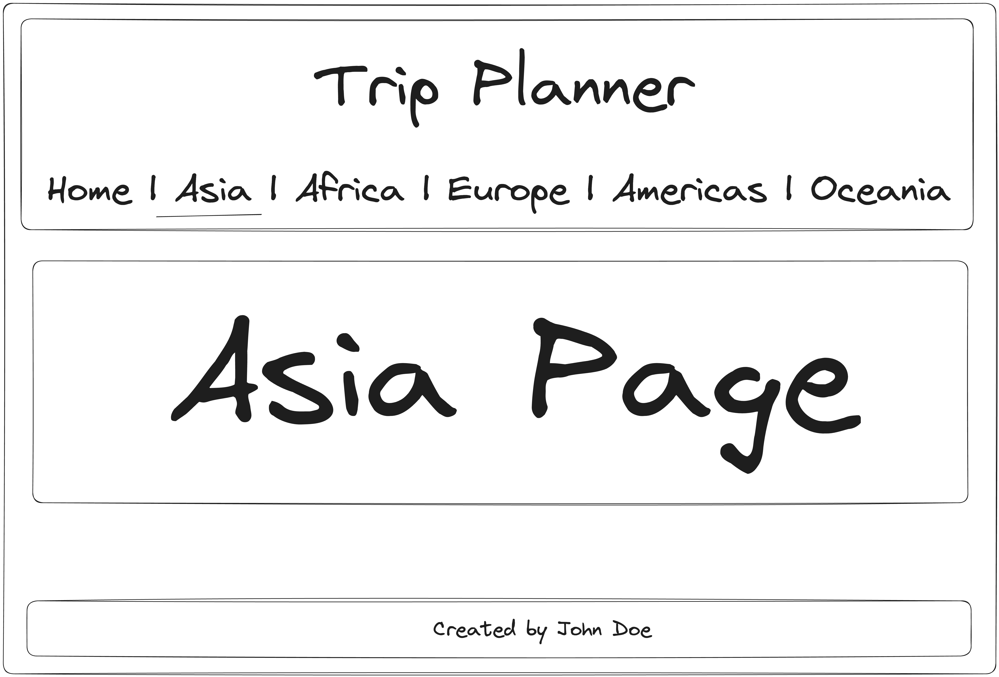

# Homework 1 - Building the React App

###### Deadline: 15.06.2024

The idea is to build a simple React app that is going to be used for planning a trip. In this assignment you just need to create a simple app and add some basic functionality to it. We need to have the starting layout and we will continue building the app from there.

## Task 1: Create a new React app

Create a new React app using vite, latest version of React and Typescript.

## Task 2: Create the following layout

- Create a header with a title and a navigation bar
- Create a main section with a title and a list of items
- Create a footer with a copyright notice



The navigation should change the page when clicked, all selected items should be displayed in the main section. No content is needed for now, just show the name of the page, e.g. "Asia page", "Europe page" etc.

Example on what should be shown when Asia is clicked:



Countries can be in component memory, and should follow the following structure:

```tsx
interface Country {
	name: {
		common: string;
	};
	capital: string[]; // Country capitals
	region: string; // Europe, Asia, Africa, Americas or Oceania
	area: number; // Country area in square kilometers
	flag: string; // path to the flag image
	population: number;
	landlocked: boolean; // if the country has access to the sea/ocean
}
```

## FAQs

Q: What to use for styling?
A: Whatever you feel comfortable with.

Q: Do I need routing?
A: No, we are not using routing for this assignment.

Q: How many countries should I use?
A: Add at least 10 countries.

Q: How many pages should I have?
A: Just the ones listed in the navigation bar.

Q: How do I measure country popularity?
A: No need, it's just a mock to show data in the app.

## Before you send it...

- Make sure you have a working React app
- Make sure you have node_modules in .gitignore
- Commit your code to a repository
- Send us a link to your repository (to the concrete folder, if you have multiple homeworks)
